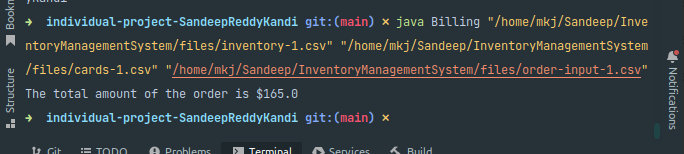
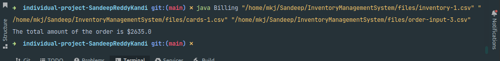
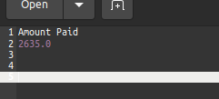

# Inventory Management System

## Problem Statement
Develop an inventory management system in which inventory details and cards details will be provided in the CSV file. Another CSV file will be provided, containing the orders information. There will be a maximum limit on the type of items (category) which can be ordered and will be set in the program at the start. In case of successful order checkout, total amount to be paid will be displayed, while in case of error, an error output file needs to be generated.

## Instructions:

Needs Java 8 installed in the system that is running the program.

- Open terminal (command prompt for windows).  (Location of JAR File is: `<Present Directory>/out/artifacts/individual-project-SandeepReddyKandi_jar/individual-project-SandeepReddyKandi.jar)`.
- Run the following command:
  `java -jar <jar_name> "<Dataset File Path>" "<Card Information File Path>" "<Order Information File Path>"`  
- Output files will be created in the directory as the files provided as arguments to run the JAR.

## Max Limits taken
- For Essentials category items: **40**
- For Luxury category items: **30**
- For Miscellaneous category items: **60**

## Design Patterns:
- Singleton
- Factory
- Chains of Responsibility

### Singleton:
- It is creational design pattern that lets you ensure that a class has only one instance, while providing the global access point to this instance.
- This pattern is used to build the database for the application. Only the Database class is used as part of this pattern.
- We are using `getInstance()` to implement this, when this method is called, we first check if the Database instance is created, if its created, we just return that one, else create a new instance and use that one.

### Factory:
- It is a creational design pattern that provides an interface for creating objects in a superclass, but allows subcasses to alter the type of objects that will be created.
- We have used this pattern to output when an order is processed. The following files are as part of this pattern implementation:
    - Interface OutputFile
    - Class CheckoutFile
    - Class ErrorFile
- The FileReader class is used to read and create files in the application.
- When the respective concrete handler figures out the output should be a checkout file or error file, we will create an object of OutputFile.

### Chains of Responsibility:
- It is a behavioral design pattern that lets you pass requests along a chain of handlers. Upon receiving a request, each handler decided either to process the request or to pass it to the next handler in the chain.
- We have used this design pattern to determine if the order can be processed correctly or not. The following files are used in this pattern:
    - Interface ValidationHandler
    - Class ItemPresenceValidation
    - Class ItemStockValidation
    - Class ItemCategoryCapValidation
- Before we verify the order can be processed or not, ValidationHandler object is created and will be passed on from one Handler to another using the same.

## Screenshots for code execution error:

### Stock inventory file path not provided

### Card Data file path not provided

### Order input file path not provided

### Test Case 1:

## Screenshots of Test Cases:

### Test Case 1:

#### Input:

#### Output:

### Test Case 2:

#### Input:

#### Output:

### Test Case 3:

#### Input:

#### Output:

### Test Case 4 (Item does not exist):

#### Input:

#### Output:

### Test Case 5 (Category limit exceeded):

#### Input:

#### Output:

